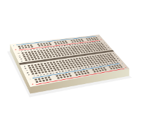

# Components

Repository of components used in [Raspberry Pi learning resources](http://www.raspberrypi.org/resources/)

[](components/) [](components/) [](components/)

## Usage

When writing resources for the Raspberry Pi website, in the repository's `hardware.yml` file, refer to the filename of the component, without file extension (they're all `.png`), like so:

```yml
- name: 1 x Solderless breadboard
  img: breadboard
  url: http://shop.pimoroni.com/products/colourful-mini-breadboard
```

This will use the text "1 x Solderless breadboard" linking to `shop.pimroni.com...` with the image `breadboard.png` (as found in [components/breadboard.png](components/breadboard.png)).

## Image files

Image files live in the [components](components/) folder. They should be `600 x 500` in dimension at 72dpi, on a transparent background.

## Contributing

Images are illustrated by our in-house designer, so we are not likely to accept submissions. Please use issues to report feedback if necessary.

## Issues

Open issues at [/issues](https://github.com/raspberrypilearning/components/issues)

## Licence

Images are covered by the following licence:

[](http://creativecommons.org/licenses/by-sa/4.0/)

***Components*** by the [Raspberry Pi Foundation](http://www.raspberrypi.org) is licensed under a [Creative Commons Attribution 4.0 International Licence](http://creativecommons.org/licenses/by-sa/4.0/).

Based on a work at https://github.com/raspberrypilearning/components
