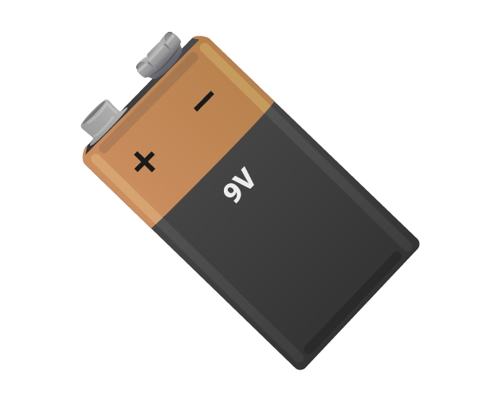

# 9V Battery

A 9V battery is used to provide 9V to a component (the Raspberry Pi will only provide upto 5V).

## Buy

Buy a 9V battery from:

- [Amazon](http://www.amazon.co.uk/Duracell-MN1604-Plus-Power-Batteries--Pack/dp/B004W7GYGQ)
