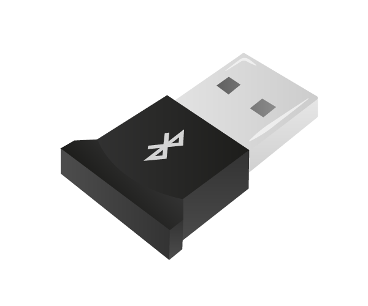

# Bluetooth Dongle

A bluetooth dongle enables the Pi to communicate with other bluetooth devices such as a mobile phone or a games controller.

## Buy

Buy a bluetooth dongle from:

- [Amazon](http://www.amazon.co.uk/Inateck%C2%AE-Wireless-Bluetooth-Adapter-Compatible/dp/B00F0CG0N4)
