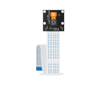

# Pi NoIR Camera

The Pi NoIR Camera is an infra-red version of the camera module used for night vision photo and video.

## Buy

Buy a Pi NoIR Camera from:

- [Pimoroni](https://shop.pimoroni.com/products/pi-camera-mount)
- [The Pi Hut](http://thepihut.com/products/raspberry-pi-noir-camera-module)
- [CPC](http://cpc.farnell.com/raspberry-pi/rpi-noir-camera-board/raspberry-pi-noir-camera-board/dp/SC13223)
- [ModMyPi](http://www.modmypi.com/raspberry-pi/camera/raspberry-pi-noir-infrared-camera-board-5mp-1080p-v1.3)
