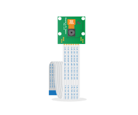

# Camera Module

The Raspberry Pi Camera Module allows you to capture images and video in your Raspberry Pi project.

## Buy

Buy a Camera Module from:

- [Pimoroni](https://shop.pimoroni.com/products/raspberry-pi-camera-module-v2-1-with-mount)
- [The Pi Hut](http://thepihut.com/products/raspberry-pi-camera-module)
- [CPC](http://cpc.farnell.com/raspberry-pi/rpi-8mp-camera-board/raspberry-pi-camera-board-8mp/dp/SC14028)
- [ModMyPi](http://www.modmypi.com/raspberry-pi/camera/raspberry-pi-camera-board-v2-8mp1080p)
