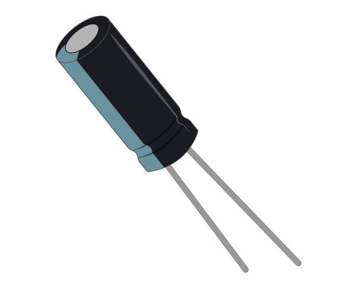

# Capacitor

A capacitor is a component capable of temporarily storing and then releasing charge.

## Buy

Buy a Capacitor from:

- [Rapid Electronics](http://www.rapidonline.com/Search?query=capacitor)
- [Ali Express](http://www.aliexpress.com/wholesale?catId=0&initiative_id=SB_20160210054931&isPremium=y&SearchText=capacitor)
