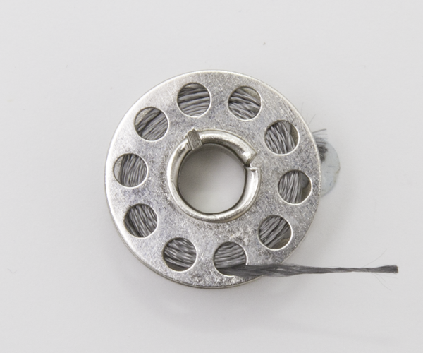

# Conductive Thread

Conductive thread is sewing thread containing a metallic element which will conduct electricity

## Buy

Buy conductive thread from:

- [Pimoroni](https://shop.pimoroni.com/products/adafruit-stainless-medium-conductive-thread-3-ply-18-meter-60-ft)
