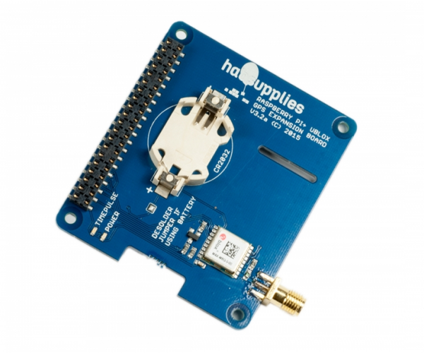

# GPS Board

Their are several GPS boards available which allow your Raspberry Pi to communicate with satelites and know where it is. Some boards can be stacked whilst others won't.

## Buy

Buy GPS baords from:

- [Hab Supplies](http://ava.upuaut.net/store/index.php?route=product/product&product_id=117)
- [Pimoroni](https://shop.pimoroni.com/products/adafruit-ultimate-gps-breakout?utm_medium=cpc&utm_source=googlepla&variant=288854706&gclid=CPT6iILwsMkCFVKZGwodjgALjQ)
- [Itead](https://www.itead.cc/raspberry-pi-gps-add-on-v2-0.html?gclid=CNjX35nwsMkCFYcSwwod4WsFHg)
