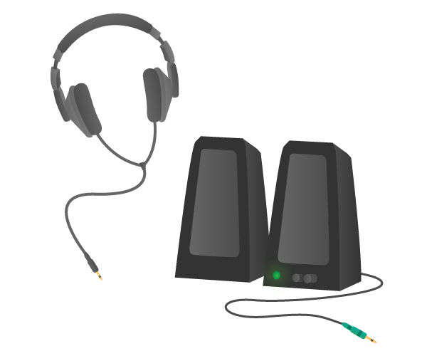

# Headphones or Speakers

Standard headphones or speakers with a 3.5mm jack can be used to play audio through the Raspberry Pi.

## Buy

Buy headphones or speakers from:

- [The Pi Hut](http://thepihut.com/products/mini-portable-speaker-for-the-raspberry-pi)
