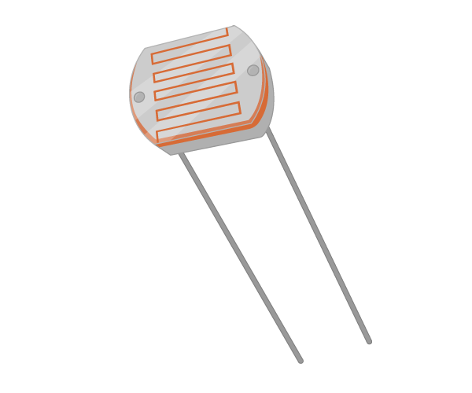

# LDR

An LDR or photocell is a component whose resistance will change depending on the intensity of light shining upon it.

## Buy

Buy an LDR from:

- [Rapid Electronics](http://www.rapidonline.com/electronic-components/truopto-nsl-5112-light-dependent-resistor-ldr-lead-free-58-0128)
- [Ali Express](http://www.aliexpress.com/premium/ldr.html?ltype=wholesale&d=y&origin=y&origin=y&isViewCP=y&catId=0&initiative_id=SB_20160210054655&SearchText=ldr)
