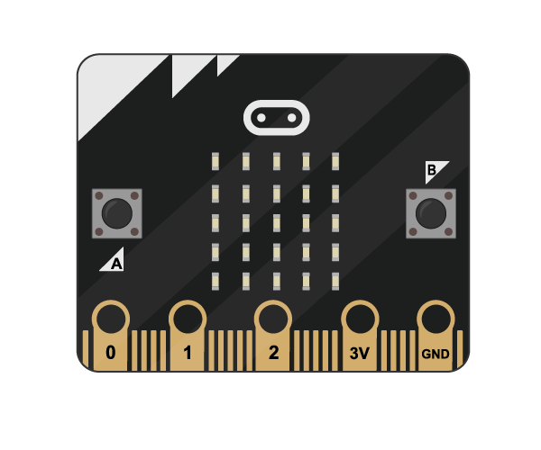

# BBC micro:bit

A pocket-sized codeable device with motion detection, a built-in compass and Bluetooth technology

## Buy

The micro:bit is currently unavailable for purchase, but has been given freely to every Year 7 student in the UK.
