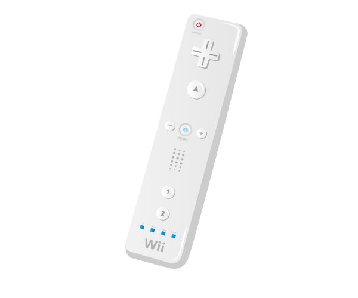

# Nintendo Wiimote

The Nintendo Wiimote is the device used for controlling and playing with the Nintendo Wii games console, and can be used over Bluetooth to control applications on the Raspberry Pi.

## Buy

Buy a Nintendo Wiimote from:

- [Amazon UK](http://www.amazon.co.uk/Nintendo-Wii-Remote-Plus-Controller/dp/B009ACAKL8)
