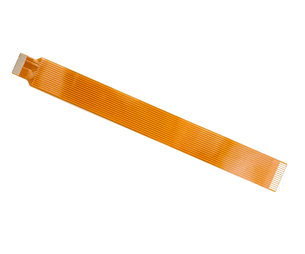

# Camera cable

A camera cable designed to connect the Camera Module to a Raspberry Pi Zero

## Buy

Buy a Raspberry Pi Zero camera cable

- [Pimoroni](https://shop.pimoroni.com/products/camera-cable-raspberry-pi-zero-edition)
- [The Pi Hut](https://thepihut.com/products/raspberry-pi-zero-camera-adapter)
- [Adafruit](https://www.adafruit.com/product/3157)
