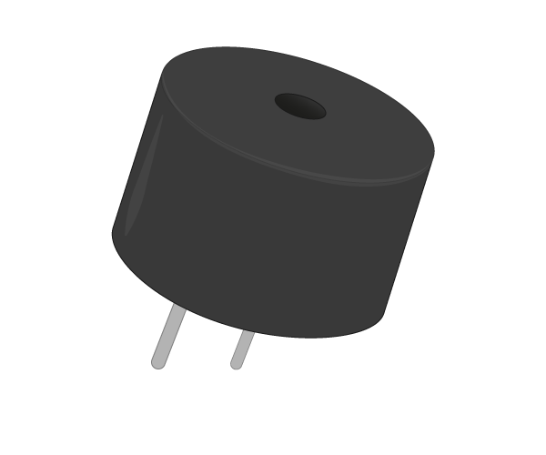

# Piezo Buzzer

A piezo buzzer is a component that produces sound when a current passes through it.

## Buy

Buy an piezo buzzer from:

- [Rapid Electronics](http://www.rapidonline.com/audio-visual/rvfm-6v-buzzer-low-profile-35-0040)
- [Ali Express](http://www.aliexpress.com/item/Black-3V-Electromagnetic-Type-Piezo-Buzzer-Continuous-Sound-Pack-of-20/1722581870.html?spm=2114.01020208.3.37.lXldn6&ws_ab_test=searchweb201556_6,searchweb201644_3_505_506_503_504_502_10001_10002_10016_10017_10010_10005_10011_10006_10003_10004_10009_10008,searchweb201560_3,searchweb1451318400_-1,searchweb1451318411_6448&btsid=4cbbd32a-0c20-4d49-98a8-f876f52b7f4f)
