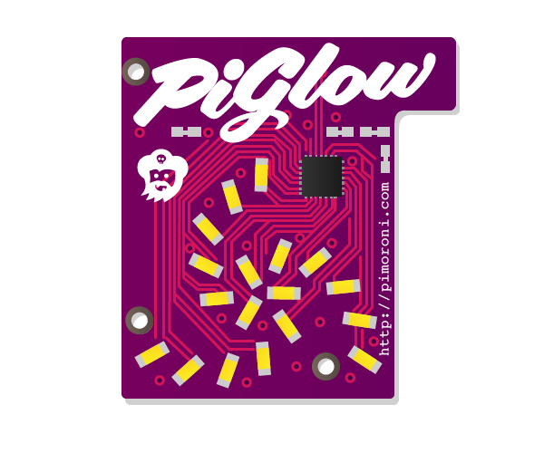

# PiGlow

The PiGlow is a small add on board for the Raspberry Pi that provides 18 individually controllable LEDs.

## Buy

Buy a PiGlow from:

- [Pimoroni](http://shop.pimoroni.com/products/piglow)
