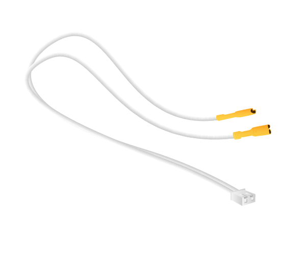

# Quick Connect Wires

A set of Quick Connect Wires is a combination of two jumper wires with female headers on one end and metal crimped wires on the other - ideal for connecting a push button to a Raspberry Pi without a breadboard.

## Buy

Buy a set of Quick Connect Wires from:

- [ModMyPi](http://www.modmypi.com/raspberry-pi/hacking-and-prototyping/buttons-and-switches/arcade-button-quick-connect-wires-set-of-10-pairs)
