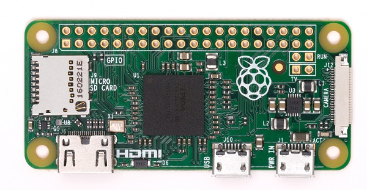

# Raspberry Pi

The Raspberry Pi Zero is half the size of a Model A+, with twice the utility. A tiny Raspberry Pi that’s affordable enough for any project!

- 1Ghz, Single-core CPU
- 512MB RAM
- Mini HDMI and USB On-The-Go ports
- Micro USB power
- HAT-compatible 40-pin header
- Composite video and reset headers
- CSI camera connector (v1.2 only)

## Buy

Buy a Raspberry Pi Zero from:

- [The Pi Hut](https://thepihut.com/collections/raspberry-pi/products/raspberry-pi-zero?variant=14062715972)
- [Adafruit](https://www.adafruit.com/product/2885)
- [Cana Kit](https://www.canakit.com/raspberry-pi-zero.html)
