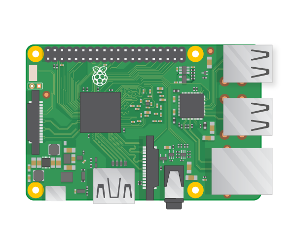

# Raspberry Pi

The Raspberry Pi 3 is the third generation Raspberry Pi. It replaced the Raspberry Pi 2 Model B in February 2016. Compared to the Raspberry Pi 2 it has:

- A 1.2GHz 64-bit quad-core ARMv8 CPU
- 802.11n Wireless LAN
- Bluetooth 4.1
- Bluetooth Low Energy (BLE)

Like the Pi 2, it also has:

- 4 USB ports
- 40 GPIO pins
- Full HDMI port
- Ethernet port
- Combined 3.5mm audio jack and composite video
- Camera interface (CSI)
- Display interface (DSI)
- Micro SD card slot (now push-pull rather than push-push)
- VideoCore IV 3D graphics core
- The Raspberry Pi 3 has an identical form factor to the previous Pi 2 (and Pi 1 Model B+) and has complete compatibility with Raspberry Pi 1 and 2.

## Buy

Buy a Raspberry Pi from:

- [RS](http://uk.rs-online.com/web/generalDisplay.html?id=raspberrypi)
- [Element 14](https://www.element14.com/community/community/raspberry-pi)
- [Allied](http://www.alliedelec.com/)
