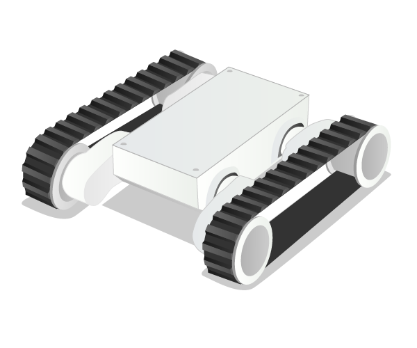

# Robot Chassis

A Robot Chassis is a base for a Raspberry Pi robot with motors built in, and two sets of tank tracks over the wheels.

## Buy

Buy a Robot Chassis from:

- [Proto Pic](http://proto-pic.co.uk/dagu-rover-5-tracked-chassis-with-encoders/)
