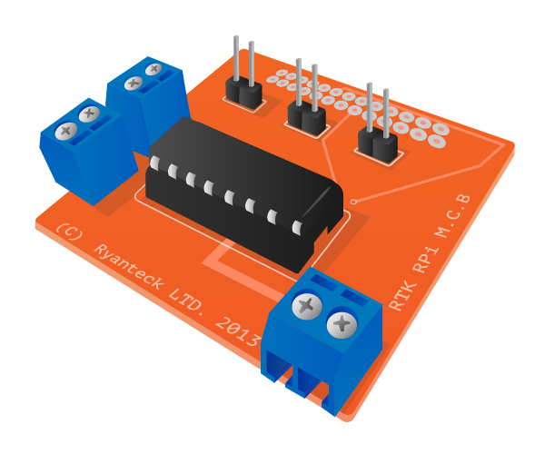

# RTK Motor Controller Board

A RTK Motor Controller Board is an add-on board for Raspberry Pi which allows simple connection to motors to drive them forwards and backwards, particularly for use in robotics.

## Buy

Buy an RTK Motor Controller Board from:

- [Ryanteck](https://ryanteck.uk/add-ons/6-ryanteck-rpi-motor-controller-board.html)
- [The Pi Hut](http://thepihut.com/products/rtk-motor-controller-board-kit)
- [Amazon UK](http://www.amazon.co.uk/Ryanteck-Raspberry-Motor-Controller-Board/dp/B00HQ20H6W)
