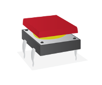

# Tactile Push Button

A tactile push button is used in an electronic circuit to allow a person to interact by turning something on or off, or triggering some event by pressing a button.

## Buy

Buy a tactile push button from:

- [Pimoroni](http://shop.pimoroni.com/products/tactile-switches)
