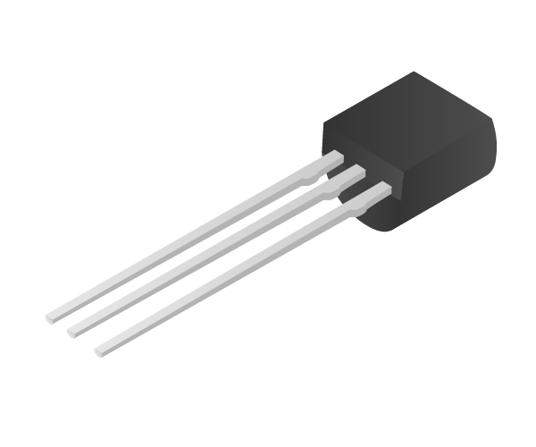

# Transistor

A transistor is an electronic component that can be used as an amplifier, or as a switch.

## Buy

Buy a Transistor from:

- [Maplin](http://www.maplin.co.uk/p/bc635-low-power-npn-transistor-to92-case-n56ac)
