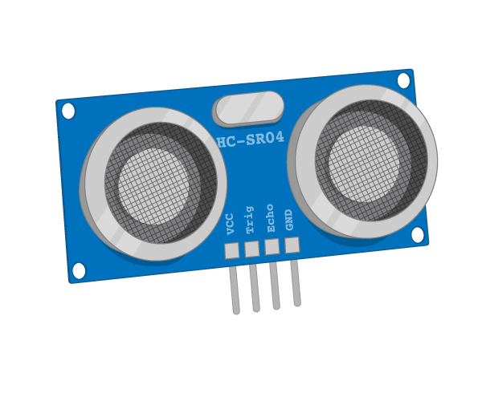

# Ultra Sonic Distance Sensor

An Ultra Sonic Distance Sensor (or range finder) uses ultrasound to detect it's distance from an object

## Buy

Buy Ultras Sonic Distance Sensors from:

- [Amazon](http://www.amazon.co.uk/HC-SR04-Distance-Measuring-Transducer-Ultrasonic/dp/B00KKKT7YK)
-[Robotshop](http://www.robotshop.com/uk/hc-sr04-ultrasonic-range-finder.html)
