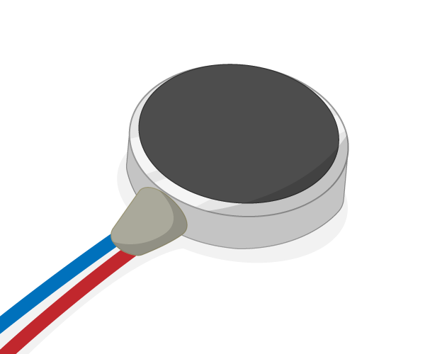

# Vibration Motor

A vibration motor vibrates when current passes through it.

## Buy

Buy vibration motors from:

- [Rapid Electronics](http://www.rapidonline.com/electronic-components/seeed-316040001-mini-vibration-motor-3v-2-0mm-circular-75-0416?&&gclid=cl6oo82jgcscfrg3gwodywwjla)
